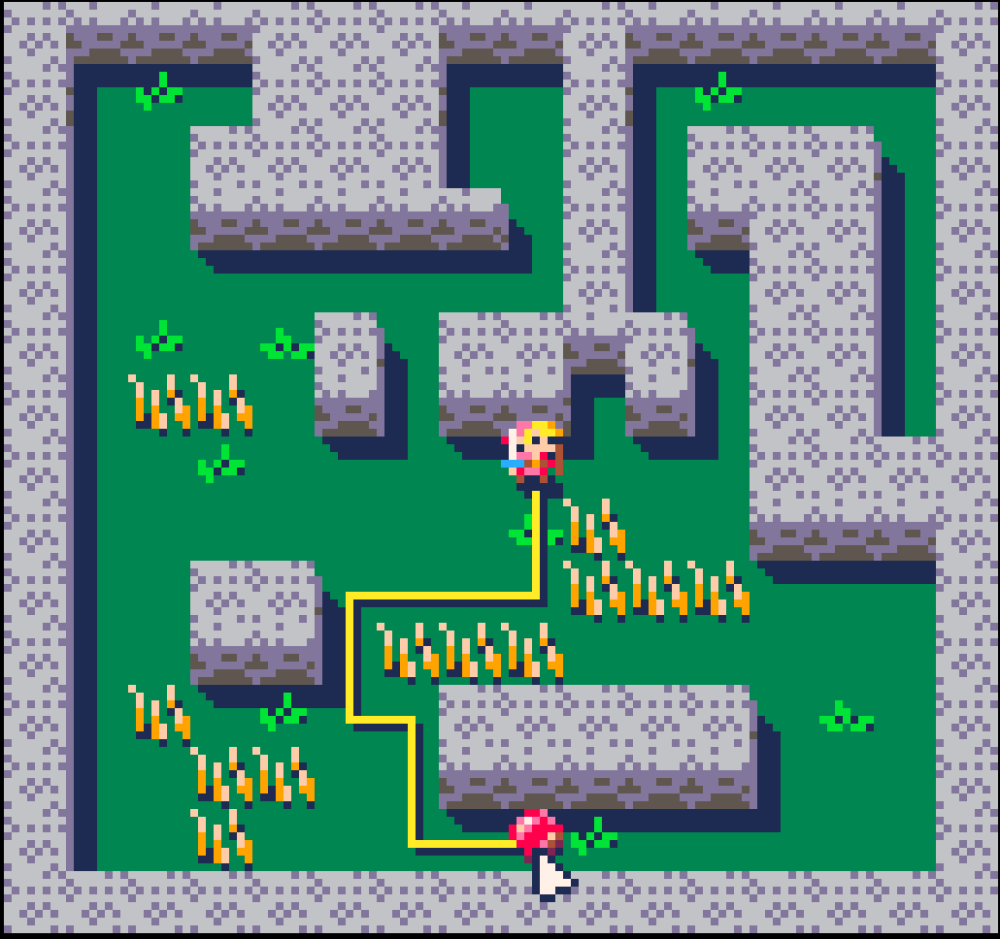

"pathfinder" is a single-function, optimized path finding library for PICO-8 Lua from the
[Graphics Codex](http://graphicscodex.com).

The `find_path` function finds a heuristically shortest path from `start` to `goal` using the
[A*](https://en.wikipedia.org/wiki/A*_search_algorithm) ("A-star") algorithm, and returns it as a list of nodes to visit. Returns `nil` if
there is no path. You can also guarantee that the true shortest path is returned (at a cost of
running longer) by providing a zero-value estimator function, which reduces `find_path` to
[Dijkstra's Algorithm](https://en.wikipedia.org/wiki/Dijkstra%27s_algorithm).

The caller determines the structure of the `node` objects and how they are connected to form
the `graph`. So, `find_path` can work with any kind of graph representation and is not limited
to using the PICO-8 map functions from the demo. You can use it with 3D maps, hex maps, etc.

# Parameters

### `start : node`
The starting position in your chosen node representation.

### `goal : node`
The goal position in your chosen node representation.

### `estimate : function(node, node, graph)`
Guesses what the total path cost is to travel from
the first node to the second in the graph. If this function
returns `0` for all paths, then `find_path` reduces to Dijkstra's 
Algorithm and guarantees that it finds the shortest path.

### `edge_cost : function(node, node, graph)`
The exact cost to move from the first node to the second, which is known to 
be its neighbor in the graph.  It does not have to be a symmetric cost, so
you can have hills, one-way doors, etc.

### `neighbors : function(node, graph)`
Returns an array of all neighbors nodes that are reachable in one step
from the argument node.

### `node_to_id : function(node, graph)`
Returns a unique integer or string for the node.  ids must be 
unique and deterministic. `node_to_id(a, g) == node_to_id(b, g)` 
must be true if and only if `a` and `b` describe the same
location.

### `graph : graph`
The graph object, of your own design. If the data needed for 
implementing the callback functions are all global, then this
may be `nil`.

See the Graphics Codex for a description of the algorithm and implementations in other languages.
